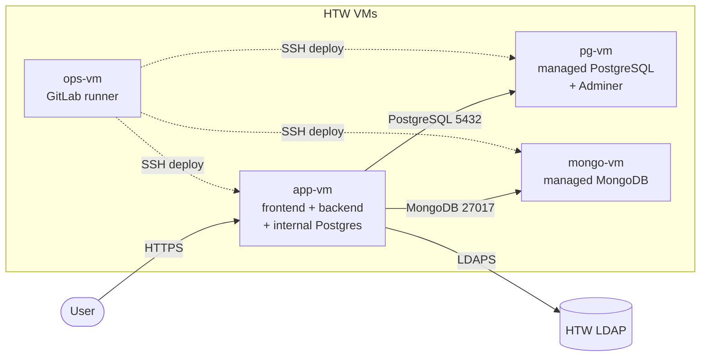

# Ocean

Ocean is a fully managed database platform: log in and launch a **PostgreSQL** or
**MongoDB** database in a few clicks, then manage it from a simple UI.

## Repository layout

| Path        | What it is                                                              |
| ----------- |-------------------------------------------------------------------------|
| `frontend/` | React 19 + Vite UI                                                      |
| `backend/`  | Scala / Play REST API                                                   |
| `ops/`      | Deployment (Infrastructure as Code): boostrap scripts, Ansible, compose |
| `docs/`     | Documentation and Guides for Development                                |

## Guides

| Guide                                         | Use it to…                               |
|-----------------------------------------------|------------------------------------------|
| [Local development](docs/local-dev.md)        | run the whole stack on your laptop       |
| [Deployment architecture](ops/README.md)     | understand the IaC setup at a glance     |
| [Deploy](docs/deploy.md)                      | ship a change to the running VMs         |
| [Provisioning](docs/provisioning.md)          | spin up Ocean on fresh VMs      |
| [Operations](docs/operations.md)              | renew TLS, rotate secrets, debug |

## Architecture overview

Ocean runs on four VMs. The **app** VM serves the UI and API and holds its own
internal database; it talks to two **managed database** VMs that Ocean provisions
for end users. A separate **ops** VM runs the CI/CD runner that deploys the rest.

